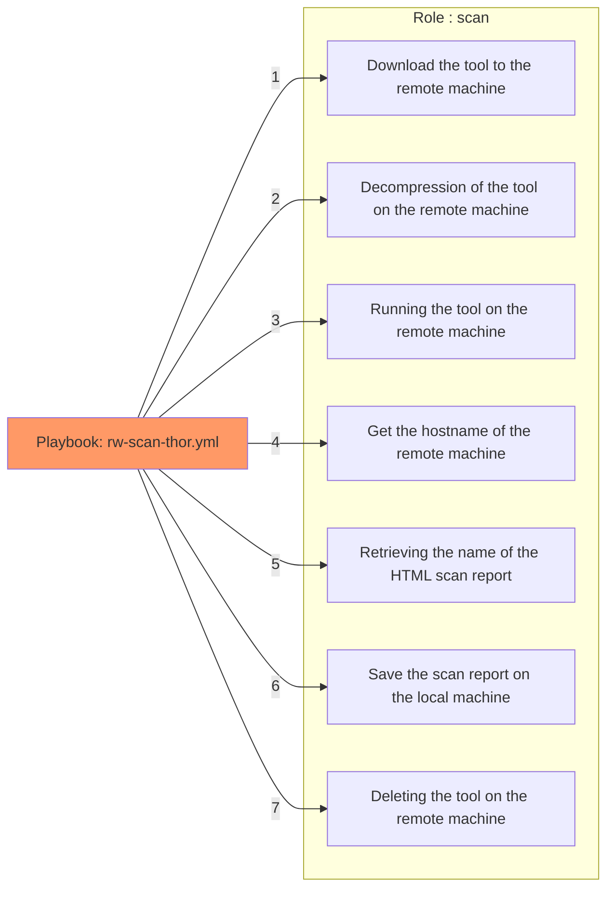

# README

The purpose of this project is to automate a [Thor](https://www.nextron-systems.com/thor-lite/) scan and the retrieval of scan reports on several servers via Ansible.

## Documentation

Features:
- Scan a specific **path** with Thor
- Retrieval of Thor scan reports



## 🛠️ Installation 

> You need to have a valid **Thor** or **Thor Lite** binary first : https://www.nextron-systems.com/thor-lite/ or https://www.nextron-systems.com/thor/


```bash
# ssh
git clone git@github.com:Nishacid/Ansible_Thor.git
# https
git clone https://github.com/Nishacid/Ansible_Thor.git

cd Ansible_Thor/
mv your_compressed_thor_files.zip roles/scan/files/thor.zip
```

In the case of using an ssh password instead of a ssh key :
```bash
apt install sshpass
export ANSIBLE_HOST_KEY_CHECKING=False
```
or in your `ansible.cfg` :

```yaml
[defaults]
host_key_checking=False
```

## Utilisation

### Scanning

```bash
ansible-playbook -i inventory.cfg -l group rw-scan-thor.yml -e path=/path/to/scan
```

#### Results

```yaml
PLAY [all] ******************************************************************************************************************************************************************************************************

TASK [Gathering Facts] ******************************************************************************************************************************************************************************************
ok: [my-compromised-host1]
ok: [my-compromised-host2]

TASK [scan : Copy Thor to Host] *********************************************************************************************************************************************************************************
changed: [my-compromised-host1]
changed: [my-compromised-host2]

TASK [scan : Thor unzip] ****************************************************************************************************************************************************************************************
changed: [my-compromised-host1]
changed: [my-compromised-host2]

TASK [scan : Thor Launching] ************************************************************************************************************************************************************************************
changed: [my-compromised-host1]
changed: [my-compromised-host2]

TASK [scan : debug] *********************************************************************************************************************************************************************************************
ok: [my-compromised-host1] => {
    "thor_log": {
        [...]
            "Info Successfully closed ThorDB"
        ]
    }
}
ok: [my-compromised-host2] => {
    "thor_log": {
        [...]
            "Info Successfully closed ThorDB"
        ]
    }
}

TASK [scan : Get Hostname] **************************************************************************************************************************************************************************************
changed: [my-compromised-host1]
changed: [my-compromised-host2]

TASK [scan : Get HTML Report name] ******************************************************************************************************************************************************************************
changed: [my-compromised-host1]
changed: [my-compromised-host2]

TASK [scan : Save HTML Report] **********************************************************************************************************************************************************************************
changed: [my-compromised-host1]
changed: [my-compromised-host2]

TASK [scan : debug] *********************************************************************************************************************************************************************************************
ok: [my-compromised-host1] => {
    "msg": "Scan report saved in ./report/thor_report_my-compromised-host1.html"
}
ok: [my-compromised-host2] => {
    "msg": "Scan report saved in ./report/thor_report_my-compromised-host2.html"
}

TASK [scan : Delete Thor on host] *******************************************************************************************************************************************************************************
changed: [my-compromised-host1]
changed: [my-compromised-host2]

PLAY RECAP ******************************************************************************************************************************************************************************************************
my-compromised-host1   : ok=10   changed=7    unreachable=0    failed=0    skipped=0    rescued=0    ignored=0
my-compromised-host2 : ok=10   changed=7    unreachable=0    failed=0    skipped=0    rescued=0    ignored=0
```

Our reports are well saved on the host machine

```bash
» tree report
report
├── thor_report_my-compromised-host1.html
└── thor_report_my-compromised-host2.html
```